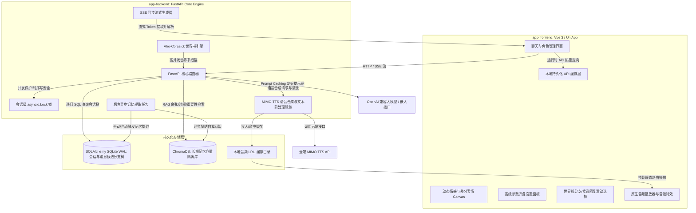

# AI Roleplay System — 智能角色扮演系统全栈主文档

这是一个基于大模型的 AI 角色扮演（AI Roleplay）全栈应用程序。项目由**前端多端应用（Vue 3 + UniApp + TypeScript）**与**后端服务（FastAPI + SQLAlchemy + SQLite + ChromaDB）**组成。系统面向单用户私有化部署设计，具备长期记忆检索（RAG）、情感与表情展示、树状分支会话、多分支候选回复、语音合成播报（TTS）、SVG 渲染兼容以及参数折叠面板等特性。

---

## 项目目录结构

```text
/APP
├── app-backend/       # 后端服务核心 (FastAPI + SQLAlchemy + ChromaDB)
│   ├── core/          # 数据库、配置、会话锁、在轨自适应迁移逻辑
│   ├── routers/       # 聊天候选分支、会话管理、角色卡管理及系统 API
│   ├── services/      # 聊天生成、MIMO-TTS 合成与文本前处理、RAG 记忆服务
│   └── README.md      # 后端专属详细技术设计与接口文档
└── app-frontend/      # 前端多端应用核心 (Vue 3 + UniApp + TypeScript + UnoCSS)
    ├── src/
    │   ├── pages/     # 首页、聊天页、角色卡管理与创建、高级设置页
    │   ├── components/# 通用动态 UI 组件（NewSessionModal、BranchTreeView 等）
    │   ├── store/     # Pinia 全局状态与会话/音频播放管理器
    │   └── api/       # API 客户端与网络拦截器
    └── README.md      # 前端项目说明文档（含手势/震动反馈等踩坑指引）
```

---

## 全栈系统架构图



---

## 核心全栈特性

### 1. 情感与差分表情展示 (Dynamic Emotion Canvas)
* **情感标签**：后端在生成回复文本时，通过大模型输出对应的情感标签 `emotion_tag`（如：开心、害羞、生气、平静等）及好感度增减 `affection_change`。
* **表情切换**：前端监听情感标签，进行差分表情的切换与预加载。好感度分数保存至数据库并反馈在 UI 状态栏中。
* **状态回滚**：当用户在前端手动删除某条 AI 回复消息时，后端自动回滚对应的好感度分数及角色心情，确保情感状态与对话历史一致。

### 2. 多分支候选回复与状态联动 (Swipe Multi-Replies)
* **多版本候选**：支持同一轮对话生成和存储多个 AI 候选回复版本（Candidates）。用户可以在前端通过左右滑动气泡切换不同的对话选项。
* **候选活跃切换 API**：前端切换气泡版本时自动调用后端的 `/chat/switch_candidate` 接口，设定特定候选消息为活跃状态（`is_active=True`）。
* **状态与音频同步**：切换候选版本时，系统会停止播放当前音频，并将对应版本的 `audio_path`、好感度和情绪标签同步切换，保障数据对应关系正确。

### 3. 语音合成与音频缓存机制 (TTS & Audio Cache)
* **发声标记**：接入云端 MIMO-v2.5-tts 语音合成 API，支持情感配音与声音事件。
* **文本处理过滤**：采用快速模型对角色扮演内容进行预处理，剔除所有星号或括号包裹的物理动作、心理活动、旁白描述，仅保留实际说话的内容，同时保护声音事件标记。
* **本地缓存与重建**：生成的音频存放在本地 `data/audio_cache`。当播放请求到达时，如果本地物理文件丢失（例如被后台 LRU 淘汰或清空），后端会自动触发重新合成，避免播放失败。

### 4. SVG 图标渲染与多端兼容
* **零第三方图标库依赖**：为避免 Uni-App 编译为原生 App 或小程序时，因为 Inline SVG 或 NPM 图标库的渲染差异导致报错，系统移除了第三方图标库。
* **静态路径渲染**：将核心图标重构为本地静态 SVG 图片，并在前端使用 `<image src="...svg">` 标签渲染，提升了跨端编译时的兼容性。
* **状态与彩色图标映射**：提供了多款不同颜色方案的 MapPin 矢量图（`modal_pin_standard.svg`、`modal_pin_teammate.svg` 等），前端根据 `routeType` 动态拼接路径，避免了 CSS `currentColor` 在 native `image` 下解析失效的问题，实现了彩色图标定位功能。

### 5. 游标滚动分页历史消息 API
* **分段加载**：会话历史查询接口 `/sessions/{id}/history` 支持 `limit`（数量限制）与 `before_id`（游标 ID）参数。
* **降低加载压力**：前端采用游标分页加载模式，初始化时仅拉取 50 条消息，滚动触顶时再按需往前加载，避免了长会话一次性加载大量消息导致的移动设备卡顿和 token 溢出问题。

### 6. 长期与短期记忆检索引擎 (Hybrid Memory Engine)
* **关系型短期上下文**：基于 SQLite WAL 关系型数据库存储最新对话，配合提示词切分。
* **隔离型长期记忆 (RAG)**：基于 ChromaDB 向量数据库，为每个角色卡隔离存储记忆分片。
* **混合打分算法**：检索排序采用多维打分策略：**余弦相似度（60%）+ 记忆重要性评级（20%）+ 时间衰减（20%）**。
* **图谱增强检索 (Graph RAG)**：提取实体（Entity）与关系（Relation）的三元组写入 SQLite。召回时与向量检索双向结合，辅助复杂关联事实的检索与推理。
* **认知与提纯机制**：会话满足阈值后触发“记忆提纯（Compaction）”，由大模型提炼聊天事实并持久化；基于高重要性记忆，更新角色对用户的“认知状态（Cognition State）”。

### 7. 多分支会话继承 (Session Tree)
* **分支会话**：用户可以从对话树的任意节点分叉（fork）出新的子分支会话，继承父会话的历史消息、好感度、心情及认知状态。
* **首条消息绑定**：开启分支时，系统自动复制触发分支的消息（或父会话的最后一条激活消息）绑定到新分支会话开头，防止新分支页面空白并保持连贯。
* **级联重连**：父会话被删除时，系统自动将子会话挂载至更上一级的祖先会话，确保聊天链与 RAG 检索的完整性。

### 8. 剧情路线选择与场景动态覆盖 (Multi-branch Route & Location Override)
* **开场白选择**：前端结构化解析并展示角色卡中配置 of `alternate_greetings`（多重开场白），提供包含剧情路线名称、地标位置、阵营徽章及正文预览的卡片。
* **地点智能提取与覆盖**：后端在创建会话时，利用场景提取算法识别开场白中的 `### 📍 (地点)` 标记或 `Location/Scene/地点/场景:` 文本前缀，写入 `SessionPersona.current_scenario_override`。AI 后续聊天会继承该地点上下文。

### 9. 世界书引擎 (Lorebook Engine & Visualizer)
* **百科展示与挂载**：在角色详情页中支持角色卡绑定外部世界书百科，并进行可视化展示。
* **Aho-Corasick 匹配**：后端引入 AC 自动机匹配算法，对文本中所有世界书关键词进行匹配，提升多词匹配场景下的运行效率。
* **条目属性审查**：卡片展示了每个条目的激活 `keys`（主关键词）、`secondary_keys`（过滤词）、`constant`（常驻触发）及匹配优先级，便于审查设定。

### 10. 参数折叠控制面板 (Collapsible Settings Panel)
* **参数映射**：前端设置页面对应后端的模型及 RAG 算法参数（包括 `temperature`、`max_tokens`、时间衰减半衰期 `retrieval_half_life_turns`、候选池放大倍率 `retrieval_candidate_multiplier` 等）。
* **折叠隐藏**：默认仅显示 4 项常用参数，其他高阶参数收纳于折叠面板内。更改通过 API 同步更新并保存到后端的 `config.yaml`。

### 11. 聊天界面置底滚动机制 (Robust Chat Scroller)
针对 UniApp/HTML5 容器在流式输出与动态高度渲染时可能出现的滚动不畅与未触底问题，前端做了如下处理：
* **初始化滚动锁**：引入 `isInitLoading` 标识，避免初始历史消息加载时引发的多次滚动定位竞争。
* **动画避让**：在流式打字输出期间关闭滚动过渡动画，发送消息或流式结束时恢复弹性缓动动画。
* **渲染延迟与微调**：采用延迟等待 DOM 渲染高度，并通过微调绑定值触发 Vue 属性监听器以确保滚动触底。

### 12. 局域网自动寻址与配置 (LAN Discovery Tool)
* **自动探针**：后端启动时会自动探测当前主机在局域网内所有活跃网卡的 IPv4 地址并在控制台打印。
* **运行时重定向**：前端设置页支持配置“后端 API 地址”，保存至本地存储。所有网络请求自动切换为新地址，方便手机真机局域网调试。

### 13. 移动端接口重定向兼容 (Mobile Network Gateway Fallback)
* **重定向降级说明**：手机 App 使用 HTTP 地址连接启用了 HTTPS 重定向的后端时，原生网络库遵循重定向规则可能将 `DELETE` 请求转为 `GET`，导致删除操作失败。
* **双通道设计**：系统删除类接口支持 `DELETE` 与 `POST .../delete` 双通道。前端使用 `POST` 方式调用删除操作以规避重定向降级问题。
* **请求参数清理**：API 客户端发送请求时自动清理空 body 或 `undefined` 参数，减少异常。

### 14. 创作者备忘录文本域 (Multiline Textarea) 优化
* **支持多行文本录入**：在“创建/编辑角色人设”界面，将“创作者备忘录”字段从原先的单行文本框 `input` 升级为多行文本域 `textarea-small`，高度从 `80rpx` 扩展到 `130rpx`。
* **解决换行截断问题**：彻底解决了卡片包含大段 Markdown 描述或备忘备注时在表单内被强制压缩在单行、左右滑动极其困难的交互痛点。

---

## 后端服务详解 (app-backend)

请参阅 [app-backend 专属 README.md](file:///g:/APP/app-backend/README.md) 获取更详细的环境配置、大模型接口定义及后台任务细节。

### 快速部署 (app-backend)
1. **安装环境依赖**（推荐 Python 3.10+）：
   ```bash
   cd app-backend
   python -m venv venv
   # Windows
   venv\Scripts\activate
   # macOS/Linux
   source venv/bin/activate
   pip install -r requirements.txt
   ```
2. **配置环境变量**：
   在 `app-backend/` 目录下创建 `.env` 配置文件：
   ```dotenv
   CHAT_API_KEY=sk-xxxxxxxxxxxxxxxx       # 对话大模型 API 密钥
   EMBEDDING_API_KEY=sk-xxxxxxxxxxxxxxxx  # 向量/嵌入模型 API 密钥
   MIMO_API_KEY=sk-xxxxxxxxxxxxxxxx       # 小米 MIMO 语音合成 API 密钥
   ACCESS_API_KEY=                        # 外部保护访问密钥（本地联调留空即可）
   ```
3. **调整运行时配置**：
   修改 `app-backend/config.yaml`，指定您的 API 基础路径、主/副模型型号以及语音缓存大小等。
4. **启动服务**：
   ```bash
   uvicorn main:app --host 0.0.0.0 --port 8000 --reload
   ```

---

## 前端多端部署 (app-frontend)

前端基于 Vue 3 + Vite + TypeScript + UniApp + Pinia 架构，支持编译为微信小程序、Android APK、iOS App 以及 H5 网页。

### 1. 开发与编译
1. **安装依赖**：
   ```bash
   cd app-frontend
   npm install
   ```
2. **本地 H5 开发预览**：
   ```bash
   npm run dev:h5
   ```
3. **构建各端资源**：
   ```bash
   # H5 网页静态发布包
   npm run build:h5
   # 微信小程序包
   npm run build:mp-weixin
   ```

---

## 自动化测试验证

后端提供了多套自动化与集成测试脚本，在 `app-backend` 目录下直接运行：

1. **TTS 语音合成与清洗单元测试**：
   ```bash
   python test_tts_api.py
   ```
2. **世界书独立单元测试**：
   ```bash
   python test_lorebook.py
   ```
3. **记忆提纯与 RAG 闭环验证**：
   ```bash
   python test_closed_loop_memory.py
   ```
4. **全流程 API 时空分支集成测试**：
   ```bash
   python test_api.py
   ```

---

## 备份与安全说明

* **单人私有化设计**：本项目数据库无多租户物理隔离。如果在公网暴露，请务必设置 `.env` 保护密钥，或在前端之前配置反向代理网关。
* **数据目录备份**：
  - SQLite 关系数据库文件：位于 `app-backend/data/data.db`。
  - ChromaDB 向量文件夹：位于 `app-backend/data/chroma_data/`。
  - 音频合成缓存文件夹：位于 `app-backend/data/audio_cache/`。
  - 迁移、备份时请**一并打包保存上述三个 data 内的文件**，即可完整平移所有会话状态、记忆以及音频库。
