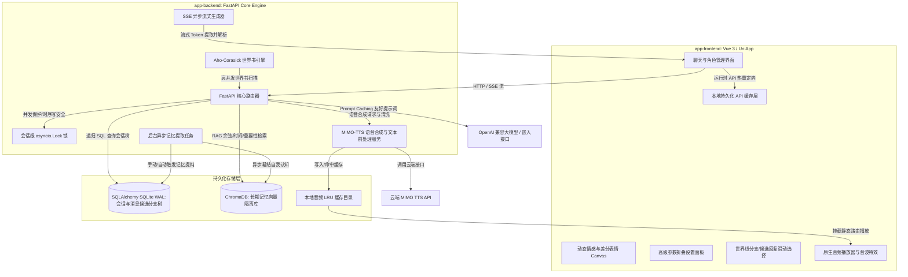

# AI Roleplay System — 智能角色扮演系统全栈主文档

这是一个前沿、高可用、高完整性的端到端 AI 角色扮演（AI Roleplay）应用程序。项目由**前端多端应用核心（Vue 3 + UniApp + TypeScript）**与**后端智能大脑服务（FastAPI + SQLAlchemy + SQLite + ChromaDB）**组成。系统面向单用户私有化部署设计，具备深度长期记忆检索（RAG）、动态情感与表情渲染、树状分支会话、多分支候选回复、语音合成播报（TTS）、独立 SVG 矢量图渲染以及渐进式折叠参数面板等核心特性。

---

## 📌 项目目录结构

```text
/APP
├── app-backend/       # 后端服务核心 (FastAPI + SQLAlchemy + ChromaDB)
│   ├── core/          # 数据库、配置、会话锁、在轨自适应迁移逻辑
│   ├── routers/       # 聊天候选分支、会话管理、角色卡管理及系统 API
│   ├── services/      # 聊天生成、MIMO-TTS 合成与文本前处理、RAG 记忆服务
│   └── README.md      # 后端专属详细技术设计与接口文档
└── app-frontend/      # 前端多端应用核心 (Vue 3 + UniApp + TypeScript + UnoCSS)
    ├── src/
    │   ├── pages/     # 首页、聊天页、角色卡管理与创建、高级设置页
    │   ├── components/# 通用动态 UI 组件（NewSessionModal、BranchTreeView 等）
    │   ├── store/     # Pinia 全局状态与会话/音频播放管理器
    │   └── api/       # API 客户端与网络拦截器
    └── API_TABLE.md   # 前端对接后端详细 API 数据模型参考
```

---

## 🏗️ 全栈系统架构图



---

## 🌟 核心全栈产品特性

### 1. 动态情感与差分表情渲染 (Dynamic Emotion Canvas)
* **智能情感分析**：后端在生成回复文本时，通过大模型自动输出精准的中文情感标签 `emotion_tag`（如：开心、害羞、生气、平静等）及好感度增减 `affection_change`。
* **平滑表情过渡**：前端实时监听情感标签，进行差分表情包的无白屏闪烁平滑切换与预加载。角色的神情随对话语境实时流转，好感度分数实时落库并反馈在 UI 状态条中。
* **状态回滚安全链**：当用户在前端手动删除某条 AI 回复消息时，后端自动逆向回滚对应的好感度分数及角色心情，确保角色情感状态与对话历史的逻辑闭环。

### 2. 多分支候选回复与状态联动 (Swipe Multi-Replies)
* **平行时空滑动**：支持同一轮对话生成和存储多个 AI 候选回复版本（Candidates）。用户可以在前端通过左右侧滑（Swipe）气泡，平滑切换不同的对话选项。
* **候选活跃切换 API**：前端切换气泡版本时自动调用后端的 `/chat/switch_candidate` 接口，设定特定候选消息为活跃状态（`is_active=True`）。
* **指标与音频同步重算**：在切换候选版本时，系统会强制停播当前音频，并将对应版本的 `audio_path`、好感度和情绪标签同步联动切换与回退，保障各个时空分支的数据正确对应。

### 3. 多模态语音合成与自愈式音频缓存管道 (TTS & Self-Healing Cache)
* **情感化配音与发声标记**：接入云端 MIMO-v2.5-tts 语音合成 API，原生支持“开心、悲伤、温柔、悄悄话”等 6 种发音情感，并能智能渲染“（叹气）、（笑声）、[inhale]（吸气）”等声音事件。
* **双文本处理器**：采用快速模型（`deepseek-v4-flash`）对角色扮演内容进行前处理，强力剔除所有星号或括号包裹的物理动作、心理活动、旁白描述，仅保留实际说话的内容，同时使用“占位符暂存机制”保护叹息、咳嗽等特殊拟真声效。
* **自愈式本地缓存**：生成的音频存放在本地 `data/audio_cache`。当播放请求到达时，即使本地物理文件丢失（例如被后台 LRU 守护线程淘汰或手动清空），后端能**自动发起被动重建**进行二次合成，确保音频链接绝不失效。

### 4. 独立 SVG 矢量图与移动端原生 `<image>` 渲染兼容
* **零 NPM 图标库依赖**：为解决 Uni-App 编译为原生 Android/iOS App 或小程序时，普通 Vue 的 Inline SVG 或 NPM 图标库因底层渲染差异常出现的无法渲染、闪退或报错问题，系统彻底移除了第三方图标库。
* **高兼容静态加载**：将关闭按钮、书籍、金色星芒等所有核心图标重构为本地静态 SVG 图片，并在前端统一使用 `<image src="...svg">` 标签渲染，这是 Uni-App 在多端环境下公认 100% 成功的最优解。
* **世界线与状态彩色化**：设计了 6 款对应色彩方案的 MapPin 矢量图（`modal_pin_standard.svg`、`modal_pin_teammate.svg` 等），前端根据 `routeType` 动态拼接路径，既避免了 CSS `currentColor` 在 native `image` 下解析失效的问题，又完美达成了高颜值彩色定位的诉求。

### 5. 游标滚动分页历史消息 API
* **分段加载**：会话历史查询接口 `/sessions/{id}/history` 升级支持 `limit`（数量限制）与 `before_id`（游标 ID）参数。
* **解决卡顿瓶颈**：前端改用游标分页加载模式，初始化时仅拉取 50 条消息，滚动触顶时再按需往前加载，彻底解决了长会话一次性加载大量消息导致的移动设备内存卡顿和 token 溢出问题。

### 6. 长期与短期记忆双轨检索引擎 (Hybrid Memory Engine)
* **关系型短期上下文**：基于 SQLite WAL 关系型数据库存储最新对话，配合高缓存密度的提示词切分。
* **隔离型长期记忆 (RAG)**：基于 ChromaDB 向量数据库，为每个角色卡隔离存储记忆分片。在发送对话时，自动切片并匹配相关性最高的人设片段。
* **三维混合打分算法**：检索排序采用多维打分策略：**余弦相似度（60%）+ 记忆重要性评级（20%）+ 时间半衰期衰减（20%）**。
* **关系型图谱增强 (Graph RAG)**：结合了基于实体（Entity）与关系（Relation）的知识图关系网络。在记忆提纯时同步提取实体与二阶事实关系写入 SQLite，召回时与向量检索进行双向增强，保证了复杂多跳关联事实推理的绝对高精度。
* **微观认知提纯系统**：会话满足条数阈值后自动/手动触发“记忆提纯（Compaction）”，由后台 LLM 提凝聊天核心事实并持久化；基于高重要性记忆，自动迭代更新角色对用户的独特“认知状态（Cognition State）”，实现长期深度的性格演化。

### 7. 多分支会话继承与级联安全链 (Session Tree)
* **平行宇宙分叉**：用户可以从对话树的任意节点 fork 出新的“子分支会话”，完美继承父会话的历史消息、好感度、心情及认知状态。
* **首发消息克隆自动绑定**：开启分支时，系统自动将触发分支的那条消息（或退避到父分支的最后一条激活消息）克隆一份绑定到新分支会话的开头，防止新分支页面空白并保持连贯。
* **级联重连保护**：当某个父会话被物理删除时，系统自动执行级联向上重连算法，将所有子会话挂载至更上一级的祖先会话，确保聊天链与 RAG 跨代检索的绝对完整。

### 8. 多重故事线选择与场景动态覆盖 (Multi-branch Route & Location Override)
* **开场剧情路线选择**：前端 [NewSessionModal.vue](file:///g:/APP/app-frontend/src/components/common/NewSessionModal.vue) 结构化解析并展示角色卡中配置的 `alternate_greetings`（多重开场白），为用户呈现包含剧情路线名称、地标位置、阵营徽章及正文预览的卡片，并配有顶部和底部淡入淡出遮罩（Gradient Mask Fade），以实现流畅美观的世界线切入。
* **地点智能提取与覆盖**：后端在创建会话时，利用强兼容场景提取算法，自动识别开场白中的 `### 📍 (地点)` 标记或 `Location/Scene/地点/场景:` 文本前缀，将其写入 `SessionPersona.current_scenario_override`。AI 在后续的聊天生成中会自动继承该地点上下文。

### 9. 独立与内置世界书引擎 (Lorebook Engine & Visualizer)
* **结构化百科展示与独立挂载**：在角色详情页 [detail.vue](file:///g:/APP/app-frontend/src/pages/character/detail.vue) 中新增“专属世界书”页签，支持角色卡独立绑定外部世界书百科，卡片化直观呈现百科设定。
* **高性能 Aho-Corasick 匹配**：后端引入 AC 自动机匹配算法，对全部文本 and 所有世界书关键词进行高效的单次匹配，彻底规避了传统正则在多词场景下的遍历计算卡顿。
* **条目属性直观调试**：卡片直观标明了每个条目的激活 `keys`（主关键词标签）、`secondary_keys`（联合过滤词）、`constant`（常驻/条件触发徽章）及匹配优先级，使得百科内容的阅读与设定审查极为方便。

### 10. 渐进式折叠参数控制面板 (Collapsible Settings Panel)
* **13 项全量参数同步**：前端设置页面完美映射了后端的全套大模型及 RAG 算法参数（包括 `temperature`、`max_tokens`、时间半衰期 `retrieval_half_life_turns`、候选池放大倍率 `retrieval_candidate_multiplier` 等）。
* **渐进式视觉隐藏**：为防止复杂算法干扰普通用户，仅默认外露 4 项基础参数。其他 9 项高阶底层参数收纳于折叠胶囊按钮内，辅以 180° 旋转箭头指示器和灵动的点按动效。所有更改通过 API 热更新并同步保存到后端的 `config.yaml`。

### 11. 无碰撞抗抖动自适应置底滚动引擎 (Robust Chat Scroller)
针对 UniApp/HTML5 容器中高频流式输出与动态高度渲染可能导致的滚动回弹、未完全触底等顽固痛点，前端实现了多重物理锁机制：
* **初始化滚动锁 (Initialization Lock)**：引入 `isInitLoading` 锁定，屏蔽初始历史消息加载引发的多次重复置底竞争。
* **动画冲突避让**：在流式打字输出期间，自动关闭滚动过渡动画（`scrollWithAnimation = false`）以规避原生渲染动画冲突；发送消息或流式结束时自动恢复弹性缓动动画。
* **渲染延迟补偿与像素微调**：采用 `80ms` 延迟，为 DOM 渲染新高度预留空隙。同时使用 `999999 - Math.random()` 随机微调机制强力唤醒 Vue 的属性监听器，实现 100% 稳定的绝对置底滚动。

### 12. 开箱即用：局域网零配自动寻址与排错 (LAN Discovery Tool)
* **多网卡自动探针**：后端启动时会自动探测当前主机在局域网内所有活跃网卡的 IPv4 地址（排除本地回环）并在控制台以高亮横幅打印。
* **运行时动态重定向**：前端设置页支持一键填写“后端 API 地址”，配置直接写入持久化缓存。所有后续网络请求和流式 SSE 自动切换为新地址，零代码修改即可进行手机真机局域网部署。

### 13. 移动端网络兼容与网关防拦截设计 (Mobile Network Gateway Fallback)
* **重定向防降级保护**：当手机 App 使用 HTTP 地址连接启用了强制 HTTPS 重定向的后端时，手机原生网络库（如 Android OkHttp）遵循 301/302 重定向规则会将非 GET 请求（如 `DELETE`）强转为 `GET`，导致会话无法正常删除或报错 405。
* **双通道设计**：系统删除类接口采用 `DELETE` 与 `POST .../delete` 双通道设计。前端全面改用百分百不被网关拦截的 `POST` 方式进行删除操作，彻底避开了移动端和 Nginx 的请求方法限制。
* **请求头自动净化**：通用 API 客户端在发送 `GET` 和 `DELETE` 请求时，会自动剥离 `Content-Type` 并意图性地剔除 `undefined` 参数，杜绝空 body 传输引发的连接异常。

### 14. 创作者备忘录文本域 (Multiline Textarea) 优化
* **支持多行文本录入**：在“创建/编辑角色人设”界面，将“创作者备忘录”字段从原先的单行文本框 `input` 升级为多行文本域 `textarea-small`，高度从 `80rpx` 扩展到 `130rpx`。
* **解决换行截断问题**：彻底解决了卡片包含大段 Markdown 描述或备忘备注时在表单内被强制压缩在单行、左右滑动极其困难的交互痛点。

---

## 后端服务详解 (app-backend)

请参阅 [app-backend 专属 README.md](file:///g:/APP/app-backend/README.md) 获取更详细的环境配置、大模型接口定义及后台任务细节。

### 快速部署 (app-backend)
1. **安装环境依赖**（推荐 Python 3.10+）：
   ```bash
   cd app-backend
   python -m venv venv
   # Windows
   venv\Scripts\activate
   # macOS/Linux
   source venv/bin/activate
   pip install -r requirements.txt
   ```
2. **配置环境变量**：
   在 `app-backend/` 目录下创建 `.env` 配置文件：
   ```dotenv
   CHAT_API_KEY=sk-xxxxxxxxxxxxxxxx       # 对话大模型 API 密钥
   EMBEDDING_API_KEY=sk-xxxxxxxxxxxxxxxx  # 向量/嵌入模型 API 密钥
   MIMO_API_KEY=sk-xxxxxxxxxxxxxxxx       # 小米 MIMO 语音合成 API 密钥
   ACCESS_API_KEY=                        # 外部保护访问密钥（本地联调留空即可）
   ```
3. **调整运行时配置**：
   修改 `app-backend/config.yaml`，指定您的 API 基础路径、主/副模型型号以及语音缓存大小等。
4. **启动服务**：
   ```bash
   uvicorn main:app --host 0.0.0.0 --port 8000 --reload
   ```

---

## 前端多端部署 (app-frontend)

前端基于 Vue 3 + Vite + TypeScript + UniApp + Pinia 架构，支持编译为微信小程序、Android APK、iOS App 以及 H5 网页。

### 1. 开发与编译
1. **安装依赖**：
   ```bash
   cd app-frontend
   npm install
   ```
2. **本地 H5 开发预览**：
   ```bash
   npm run dev:h5
   ```
3. **构建各端资源**：
   ```bash
   # H5 网页静态发布包
   npm run build:h5
   # 微信小程序包
   npm run build:mp-weixin
   ```

---

## 自动化测试验证

后端提供了多套自动化与集成测试脚本，在 `app-backend` 目录下直接运行：

1. **TTS 语音合成与清洗单元测试**：
   ```bash
   python test_tts_api.py
   ```
2. **世界书独立单元测试**：
   ```bash
   python test_lorebook.py
   ```
3. **记忆提纯与 RAG 闭环验证**：
   ```bash
   python test_closed_loop_memory.py
   ```
4. **全流程 API 时空分支集成测试**：
   ```bash
   python test_api.py
   ```

---

## 备份与安全说明

* **单人私有化设计**：本项目数据库无多租户物理隔离。如果在公网暴露，请务必设置 `.env` 保护密钥，或在前端之前配置反向代理网关。
* **数据目录备份**：
  - SQLite 关系数据库文件：位于 `app-backend/data/data.db`。
  - ChromaDB 向量文件夹：位于 `app-backend/data/chroma_data/`。
  - 音频合成缓存文件夹：位于 `app-backend/data/audio_cache/`。
  - 迁移、备份时请**一并打包保存上述三个 data 内的文件**，即可完整平移所有会话状态、记忆以及音频库。
