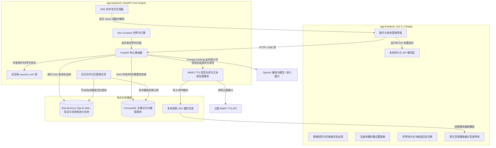

# AI Roleplay System — 智能角色扮演系统全栈主文档

这是一个基于大模型的 AI 角色扮演（AI Roleplay）全栈应用程序。项目由前端多端应用（Vue 3 + UniApp + TypeScript）与后端服务（FastAPI + SQLAlchemy + SQLite + ChromaDB）组成，主要面向单用户私有化部署设计。

---

## 项目初衷与应用场景

本项目由作者基于本人的日常需要开发制作，旨在提供高度私密、可定制的 AI 虚拟角色互动体验（如个性化的角色扮演娱乐等）。通过本地私有化部署，用户可以在完全保障数据隐私的前提下，构建拥有长期记忆与世界观设定的 AI 伴侣。

同时，作者也希望本项目的全栈实现方案（FastAPI + UniApp 跨平台）能为其他有类似私有化部署或 AI 角色扮演系统开发需求的朋友提供一些参考与启发。

---

## 核心产品功能模块

### 沉浸式角色对话 (Chat & Roleplay)
* **气泡式对话流**：支持流式打字输出，气泡对话框内会直接渲染出 AI 角色当前的情绪标签与好感度变动。
* **SillyTavern 兼容状态指标**：为了兼容 SillyTavern 角色卡规范，对话产生的情绪标签（Emotion Tag）及好感度变动数据会存储在数据库中，支持在界面中以状态指示器形式展示。
* **配音朗读与过滤 (TTS)**：集成云端语音合成接口，支持自动或手动播放语音。系统会自动剔除文本中星号或括号包裹的物理动作与旁白描述，仅保留角色台词。

### 多分支剧情与世界线 (Story Branching & Worldlines)
* **多候选回复切换 (Candidates)**：同一轮对话支持生成和存储多个 AI 候选回复版本。用户可以通过点击气泡底部的翻页按钮进行切换，在不同的 AI 回复之间自由选择，对应的好感度与音频也会同步更新。
* **剧情分支分叉 (Fork)**：支持从任意历史消息节点一键分叉出新的子会话。新分支会继承上一代会话的好感度、心情及认知状态，并自动克隆起始消息，确保上下文连贯。

### 角色工坊 (Character Studio)
* **角色卡解析**：支持直接拖拽或上传 SillyTavern 规格的 PNG 角色卡或 JSON 文件，系统能自动清洗 HTML 标签并解析生成结构化角色数据。
* **完整人设自定义**：支持可视化编辑角色名、头像、核心人设描述、性格特点、开场白、首条消息绑定以及提示词覆盖等参数。

### 独立百科世界书 (Lorebooks)
* **设定集管理**：支持可视化创建、编辑独立世界书（Lorebooks），用于构建角色专属的设定百科库。
* **触发机制微调**：支持配置激活关键词、常量激活、触发权重、最大扫描深度等触发规则。
* **多对多绑定**：世界书独立于角色卡存储，可与不同的角色卡进行自由绑定或解绑。

### 记忆与图谱审查 (Memory & Graph Review)
* **语义记忆管理**：展示系统从历史对话中提纯出的语义记忆碎片（MemoryChunks），支持用户直接手动添加、修改或删除。
* **知识图谱关系网络**：支持图谱三元组（实体与关系）的后台检索与浏览，辅助复杂关联事实的关联。
* **Prompt 组装预览**：调试模式下，可以一键获取并预览最近一轮提交给大模型的完整 System Prompt 拼接详情（包含被检索激活的记忆与世界书内容）。

### 参数控制面板 (Settings Panel)
* **常用与高级参数调节**：提供便捷的控制面板，支持调整大模型温度（temperature）、上下文携带量、RAG 检索阈值、AC 自动机深度等后端运行时参数，修改后自动持久化。

### 移动端 App 支持 (Mobile App Support)
* **原生云打包**：前端基于 UniApp 跨平台框架，支持使用 HBuilderX 开发工具直接打包为 Android (.apk) 或 iOS (.ipa) 原生应用，方便在手机上进行便捷、沉浸式的对话体验。

---

## 核心技术与工程特性

* **混合检索记忆管道 (RAG & Graph RAG)**：结合 ChromaDB 语义向量匹配（余弦距离）与 SQLite 事实三元组图谱检索。利用多维打分（余弦相似度 + 重要性评分 + 时间指数衰减）与祖先链递归，提取近期聊天并归纳为角色自我认知。
* **会话级并发锁**：使用 `asyncio.Lock` 实现单会话串行处理，锁生命周期绑定到 SSE 的流式连接，防止高并发导致的数据库写入乱序。
* **高速世界书扫描**：后端引入 Aho-Corasick（AC自动机）算法，单轮会话中对世界书关键词进行高效匹配，支持扫描深度限制与 Token 预算截断。
* **数据库在轨自适应迁移**：启动阶段自动载入 Alembic，自动扫描并将 SQLite (WAL模式) 表升级到最新版本，并在旧数据存在时执行 baseline 自动标记对齐。
* **异步事务发件箱 (Outbox)**：采用事务型发件箱模式异步消费后台任务（如物理文件删除、向量库清理等），并使用指数退避算法重试，保证 SQLite 提交与外部存储清理的数据一致性。
* **滚动分页与性能优化**：通过游标 `before_id` 分页拉取历史消息，避免长会话引起的内存与网络暴涨。前端采用初始化滚动锁与渲染微调值，确保打字机流式输出时的置底滚动性能。
* **多端与跨平台兼容**：Uni-App 前端移除第三方图标库依赖，改用本地静态 SVG 渲染；提供 HTTP 删除端点与 `POST .../delete` 双通道降级以规避移动端网络代理重定向可能引起的 `DELETE` 方法变更为 `GET` 的现象；提供局域网自动探针寻址功能，方便移动真机联调。

---

## 项目目录结构

```text
/APP
├── app-backend/       # 后端服务核心 (FastAPI + SQLAlchemy + ChromaDB)
│   ├── core/          # 数据库、配置、会话锁、在轨自适应迁移逻辑
│   ├── routers/       # 聊天候选分支、会话管理、角色卡管理及系统 API
│   ├── services/      # 聊天生成、MIMO-TTS 合成与文本前处理、RAG 记忆服务
│   └── README.md      # 后端专属详细技术设计与接口文档
└── app-frontend/      # 前端多端应用核心 (Vue 3 + UniApp + TypeScript + UnoCSS)
    ├── src/
    │   ├── pages/     # 首页、聊天页、角色卡管理与创建、高级设置页
    │   ├── components/# 通用动态 UI 组件（NewSessionModal、BranchTreeView 等）
    │   ├── store/     # Pinia 全局状态与会话/音频播放管理器
    │   └── api/       # API 客户端与网络拦截器
    └── README.md      # 前端项目说明文档（含手势/震动反馈等踩坑指引）
```

---

## 全栈系统架构图



---

## 后端服务快速部署 (app-backend)

请参阅 [app-backend 专属 README.md](file:///g:/APP/app-backend/README.md) 获取更详细的环境配置、大模型接口定义及后台任务细节。

1. **安装环境依赖**（推荐 Python 3.10+）：
   ```bash
   cd app-backend
   python -m venv venv
   # Windows
   venv\Scripts\activate
   # macOS/Linux
   source venv/bin/activate
   pip install -r requirements.txt
   ```
2. **配置环境变量**：
   在 `app-backend/` 目录下创建 `.env` 配置文件：
   ```dotenv
   CHAT_API_KEY=sk-xxxxxxxxxxxxxxxx       # 对话大模型 API 密钥
   EMBEDDING_API_KEY=sk-xxxxxxxxxxxxxxxx  # 向量/嵌入模型 API 密钥
   MIMO_API_KEY=sk-xxxxxxxxxxxxxxxx       # 小米 MIMO 语音合成 API 密钥
   ACCESS_API_KEY=                        # 外部保护访问密钥（本地联调留空即可）
   ```
3. **调整运行时配置**：
   修改 `app-backend/config.yaml`，指定您的 API 基础路径、主/副模型型号以及语音缓存大小等。
4. **启动服务**：
   ```bash
   uvicorn main:app --host 0.0.0.0 --port 8000 --reload
   ```

---

## 前端服务开发部署 (app-frontend)

前端基于 Vue 3 + Vite + TypeScript + UniApp + Pinia 架构，支持编译为微信小程序、Android APK、iOS App 以及 H5 网页。

1. **安装依赖**：
   ```bash
   cd app-frontend
   npm install
   ```
2. **本地 H5 开发预览**：
   ```bash
   npm run dev:h5
   ```
3. **构建各端资源**：
   ```bash
   # H5 网页静态发布包
   npm run build:h5
   # 微信小程序包
   npm run build:mp-weixin
   ```

---

## 自动化测试验证

后端提供了多套自动化与集成测试脚本，在 `app-backend` 目录下直接运行：

1. **TTS 语音合成与清洗单元测试**：
   ```bash
   python test_tts_api.py
   ```
2. **世界书独立单元测试**：
   ```bash
   python test_lorebook.py
   ```
3. **记忆提纯与 RAG 闭环验证**：
   ```bash
   python test_closed_loop_memory.py
   ```
4. **全流程 API 时空分支集成测试**：
   ```bash
   python test_api.py
   ```

---

## 数据备份与安全说明

* **单人私有化设计**：本项目数据库无多租户物理隔离。如果在公网暴露，请务必设置 `.env` 保护密钥，或在前端之前配置反向代理网关。
* **数据目录备份**：
  - SQLite 关系数据库文件：位于 `app-backend/data/data.db`。
  - ChromaDB 向量文件夹：位于 `app-backend/data/chroma_data/`。
  - 音频合成缓存文件夹：位于 `app-backend/data/audio_cache/`。
  - 迁移、备份时请**一并打包保存上述三个 data 内的文件**，即可完整平移所有会话状态、记忆以及音频库。
