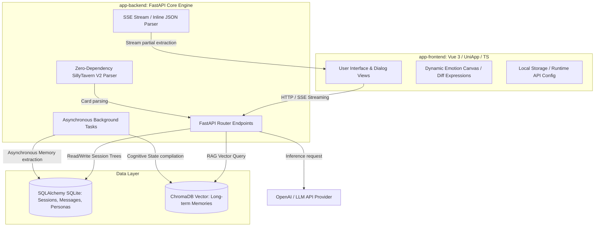

# AI Roleplay System — 智能角色扮演系统主文档

这是一个端到端的 AI 角色扮演（AI Roleplay）应用程序。项目由前端 UniApp 移动端/网页端应用与后端 FastAPI 核心大脑两部分组成，具备深度长期记忆检索（RAG）、动态情感表情渲染、微认知更新等前沿特性。

---

## 项目目录结构

```text
/APP
├── app-backend/       # Python 后端服务核心 (FastAPI + SQLAlchemy + ChromaDB)
└── app-frontend/      # 前端多端应用核心 (Vue 3 + UniApp + TypeScript + UnoCSS)
```

---

## 系统架构图 (System Architecture)



---

## 核心产品特性

1. **动态情感与差分表情包渲染 (Dynamic Emotion Canvas)**
   - 后端在生成文本的同时，通过大模型自动输出精准的中文 `emotion_tag`（如：开心、生气、平静、害羞等）与好感度增减 `affection_change`。
   - 前端动态监听情感标签，进行差分表情包的平滑切换与预加载，角色神情随对话语境实时变化，无白屏闪烁。

2. **长期与短期记忆双轨引擎 (Hybrid Memory Engine)**
   - **短期记忆**：基于 **SQLite** (`SQLAlchemy`) 存储关系型对话上下文。
   - **长期记忆 (RAG)**：基于 **ChromaDB** 向量数据库，在发送对话时，自动切片并匹配背景设定中相关性最高的人设片段。
   - **记忆提纯**：支持会话级自动/手动触发“记忆提纯”（Memory Compaction），将聊天中产生的核心事件凝结为长期记忆持久化存储。
   - **微认知系统**：实时追踪角色对用户的关系变化，提炼并动态更新角色对用户的独特“认知状态”（Cognition State）。

3. **分支会话继承与级联安全链**
   - 玩家可以在对话的任意一处拉出一条平行时空“子分支会话”，完美继承父会话的历史消息。
   - 提供安全的级联重连算法：当父会话被删除时，子会话会自动向上重新链接到更上一级的祖先会话，保证聊天时间线和引用关系的绝对完整。

4. **开箱即用：局域网零配自动寻址与排错 (LAN Discovery Tool)**
   - 后端启动时会自动探测当前主机在局域网内所有活跃网卡的 IPv4 地址（排除本地回环）。
   - 在控制台中以高可读性的 ASCII 横幅格式打印所有可用的局域网 IP，并附带针对手机联调的详细防火墙和网络配置排错指引，彻底解决联调部署时手机端因输入错 IP 而连不上后端的痛点。

5. **渐进式高级配置与折叠式参数面板 (Collapsible Advanced Settings)**
   - 前端设置页面已完美同步后端全部 13 项 AI 对话生成与记忆检索参数，新增支持最大输出 Token 数 (`max_tokens`)、时间衰减半衰期 (`retrieval_half_life_turns`) 以及检索候选池放大倍率 (`retrieval_candidate_multiplier`) 的前端动态修改与持久化落库。
   - **高可读性与精美 UI 反馈**：为了防止复杂的算法参数干扰普通用户，默认在“AI 引擎参数”卡片中仅展示 4 项最基础的配置。下方采用精心设计的虚线边框折叠胶囊按钮（`.advanced-toggle-btn`），将 9 项高阶底层参数优雅隐藏。折叠状态下有清晰的灰色辅助标签提示所包含的项目，并配合 180 度旋转箭头指示器和精细的点按动效，带来极佳的交互体验。

6. **无碰撞抗抖动自适应置底滚动引擎 (Robust Chat Scroller)**
   - 彻底解决 UniApp/HTML5 容器中高频流式输出与动态高度渲染可能导致的滚动回弹、未完全触底等顽固痛点：
     - **初始化滚动锁 (Initialization Lock)**：引入 `isInitLoading` 状态锁定，屏蔽初始历史消息加载和状态变更引发的多路重叠滚动竞争，确保进入页面时平滑、无抖动地瞬间单次置底。
     - **动画冲突避让**：在流式打字输出高频节流更新期间，自动关闭滚动过渡动画（`scrollWithAnimation = false`）以规避原生渲染动画冲突；在发送消息或流式结束时自动恢复弹性缓动动画。
     - **布局计算补偿延迟与随机微调**：在 `scrollToBottom` 中增加 `80ms` 延迟，给渲染引擎留出计算 DOM 新高度的空隙。同时采用 `999999 - Math.random()` 随机微调机制，强力唤醒 Vue 的属性变化监听器，实现 100% 稳定的绝对置底滚动。

---

## 后端核心技术特性 (app-backend)

后端作为本系统的“智能大脑”，在服务架构、提示词工程、高并发安全、及长期检索（RAG）管道上实现了如下关键工程优化：

1. **缓存友好型提示词引擎 (Prompt Caching & Alternating Roles)**
   - **纯静态设定分离**：重构提示词拼接逻辑，将核心人物卡设定、输出范式及对话示例等**静态数据**放入主 `system_prompt` 中，最大化激活各大 API 服务商的 Prompt Caching，大幅降低延迟与消耗。
   - **动态 XML 闭包装箱**：将自我认知状态、RAG 召回记忆等**高动态上下文**使用 `<thought>` / `<memories>` / `<lorebook>` 等 XML 闭包标签包裹，注入到最新一条 `user` 消息的尾端，实现动静内容完美分离。
2. **异步线程安全会话锁 (Session Lock)**
   - 引入全局并发锁与 30s 获取超时机制。针对流式接口 `/chat/stream`，实现了**锁的延迟释放机制**（将锁释放绑定到 SSE 异步生成器的 `finally` 块中），彻底杜绝由于多客户端请求竞态导致的历史消息写入乱序或覆盖。
3. **自愈式向量维度自动对齐 (Embedding Dimension Self-healing)**
   - 在 Embedding 管道中引入维度探测与静态缓存，当检测到第三方嵌入 API 暂时故障或 Collection 切换时，可动态自愈并以准确维度对齐的零向量进行 Fallback，根治了 ChromaDB 报错崩溃问题。
4. **服务层 Facade 外观模式拆分**
   - 将臃肿的数据处理解耦为独立的世界书扫描引擎 (`lorebook_engine.py`)、会话级联重连逻辑 (`session_service.py`) 及微观认知总结服务 (`cognition_service.py`)，由 `MemoryManager` 外观层统一协调，确保 100% 向后兼容。
5. **零依赖 ST Card V2 角色卡解析**
   - 支持原生 PNG 角色卡解析，自主提取 `tEXt` / `zTXt` / `iTXt` 数据块内容，自动过滤并清洗 HTML 标签为 Markdown，减少上下文开销并防范注入风险。

---

## 后端服务部署 (app-backend)

后端采用 FastAPI 框架，底层数据库集成 SQLite 与 ChromaDB 向量检索。

### 1. 环境依赖准备
* 系统要求：Windows / macOS / Linux
* 运行环境：Python 3.10 及以上版本

### 2. 快速启动指南
```bash
# 1. 进入后端根目录
cd app-backend

# 2. 创建并激活虚拟环境 (以Windows为例)
python -m venv venv
venv\Scripts\activate

# 3. 安装依赖包
pip install -r requirements.txt

# 4. 配置环境变量与参数
# 复制或编辑 .env 文件，填写你的大模型 API_KEY 
# 编辑 config.yaml 配置模型名称、嵌入模型及 RAG 检索参数

# 5. 启动服务 (自动监听全网口，提供局域网外部设备访问)
uvicorn main:app --host 0.0.0.0 --port 8000
```

### 3. 部署控制台输出效果
后端成功启动后，将自动呈现以下指引横幅，部署者可直接将局域网 IP 填入前端进行真机联调试玩：
```text
================================================================================
 [OK] AI Roleplay Backend 已成功启动并就绪！
================================================================================
 1. 本地开发调试地址 (当前机器访问):
    -> http://127.0.0.1:8000

 2. 局域网访问地址 (同一 Wi-Fi 或局域网内的手机/其他设备访问):
    -> http://192.168.1.105:8000
    -> http://10.0.0.12:8000

 * 使用提示：
    - 如果在手机 App/小程序中连接此后端，请在设置中输入上述任意一个局域网地址。
    - 确保手机与运行本后端的电脑连接在【同一个 Wi-Fi】下。
    - 若连接失败，请检查电脑防火墙是否允许 8000 端口入站流量。
================================================================================
```

---

## 前端多端部署 (app-frontend)

前端基于 Vue 3 + Vite + TypeScript + UniApp + Pinia 架构，支持编译为小程序、Android APK、iOS App 以及 H5 网页。

### 1. 开发调试
```bash
# 1. 进入前端根目录
cd app-frontend

# 2. 安装项目依赖
npm install

# 3. 运行本地开发服务器 (以编译至H5端为例)
npm run dev
```

### 2. 配置后端连接
项目预留了灵活的后端寻址设置：
* **开发环境默认值**：在开发阶段，前端会自动读取 `import.meta.env.VITE_API_BASE_URL` 或回退至 `http://127.0.0.1:8000`。
* **运行时动态修改**：在应用内的 **设置页面**，用户可以直接修改 **后端 API Base URL**，该配置会即时通过 `uni.setStorageSync` 写入持久化缓存中，所有后续网络请求（`request`）都会自动切换为新地址，非常适合真机局域网部署与切换。

---

## 自动化测试验证 (Backend Tests)

后端提供了多套自动化与集成测试脚本，用以保障核心记忆管道和 API 会话树的演进正确性。在 `app-backend` 目录下，您可以激活虚拟环境后运行：

1. **世界书独立单元测试**：
   ```bash
   python test_lorebook.py
   ```
   - 验证常驻触发、selective 模糊匹配、递归唤醒以及 Token 预算等预算截断规则。
2. **记忆提纯与 RAG 闭环验证**：
   ```bash
   python test_closed_loop_memory.py
   ```
   - 模拟完整写入事实 $\rightarrow$ 触发记忆总结归档 $\rightarrow$ 校验 ChromaDB 召回及发问回传，验证混合检索精排打分。
3. **API 全流程继承测试**：
   ```bash
   python test_api.py
   ```
   - 涵盖从角色创建、会话新建、流式对话、分支宇宙（会话树继承）到父会话删除级联重连的所有业务流。

---

## 网络与防火墙排错指引（极重要）

当在真实手机、Pad 或另一台局域网电脑上测试时，如果无法与后端建立连接，请依次进行如下排查：

1. **统一局域网检查**：请确保手机所连接的 Wi-Fi 与启动后端的电脑处于同一子网。
2. **Windows 防火墙入站规则放行**：
   - 默认情况下，Windows 防火墙可能会拦截未授权的 8000 端口外部入站流量。
   - **解决方法**：打开 `控制面板 -> 系统和安全 -> Windows Defender 防火墙 -> 高级设置 -> 入站规则`，新建一条规则放行 **TCP 协议 8000 端口**，或者允许 `python.exe` 穿越防火墙。
3. **混合内容安全限制（HTTPS H5 专属）**：
   - 如果您把前端打包为了 H5 网页并部署在带有 HTTPS 的域名上，此时浏览器会出于安全策略拦截向局域网 HTTP 后端（`http://192.168.x.x:8000`）发起的明文请求。
   - **解决方法**：推荐使用手机 App/微信小程序调试，或者在浏览器安全选项中为您的测试网站临时勾选“允许混合内容”。
