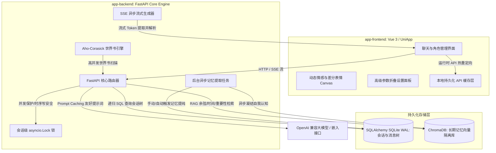

# AI Roleplay System — 智能角色扮演系统全栈主文档

这是一个前沿、高可用、高完整性的端到端 AI 角色扮演（AI Roleplay）应用程序。项目由**前端多端应用核心（Vue 3 + UniApp + TypeScript）**与**后端智能大脑服务（FastAPI + SQLAlchemy + SQLite + ChromaDB）**组成。系统面向单用户私有化部署设计，具备深度长期记忆检索（RAG）、动态情感与表情渲染、树状分支会话、渐进式折叠参数面板等核心特性。

---

## 项目目录结构

```text
/APP
├── app-backend/       # 后端服务核心 (FastAPI + SQLAlchemy + ChromaDB)
│   ├── core/          # 数据库、配置、会话锁、鉴权逻辑
│   ├── routers/       # 聊天、会话、角色卡管理及系统 API
│   ├── services/      # 聊天生成、RAG 记忆、世界书匹配、认知更新服务
│   └── README.md      # 后端专属详细技术设计与接口文档
└── app-frontend/      # 前端多端应用核心 (Vue 3 + UniApp + TypeScript + UnoCSS)
    ├── src/
    │   ├── pages/     # 首页、聊天页、角色卡管理页、高级设置页
    │   ├── components/# 通用动态 UI 组件
    │   ├── store/     # Pinia 全局状态与会话管理
    │   └── api/       # API 客户端与网络拦截器
    └── API_TABLE.md   # 前端对接后端详细 API 数据模型参考
```

---

## 🏗️ 全栈系统架构图



---

## 核心全栈产品特性

### 1. 动态情感与差分表情渲染 (Dynamic Emotion Canvas)
* **智能情感分析**：后端在生成回复文本时，通过大模型自动输出精准的中文情感标签 `emotion_tag`（如：开心、害羞、生气、平静等）及好感度增减 `affection_change`。
* **平滑表情过渡**：前端实时监听情感标签，进行差分表情包的无白屏闪烁平滑切换与预加载。角色的神情随对话语境实时流转，好感度分数实时落库并反馈在 UI 状态条中。
* **状态回滚安全链**：当用户在前端手动删除某条 AI 回复消息时，后端自动逆向回滚对应的好感度分数及角色心情，确保角色情感状态与对话历史的逻辑闭环。

### 2. 长期与短期记忆双轨检索引擎 (Hybrid Memory Engine)
* **关系型短期上下文**：基于 SQLite WAL 关系型数据库存储最新对话，配合高缓存命中设计。
* **隔离型长期记忆 (RAG)**：基于 ChromaDB 向量数据库，为每个角色卡隔离存储记忆分片。在发送对话时，自动切片并匹配相关性最高的人设片段。
* **混合打分算法**：检索排序采用多维打分策略：**余弦相似度（60%）+ 记忆重要性评级（20%）+ 时间半衰期衰减（20%）**。
* **微观认知提纯系统**：会话满足条数阈值后自动/手动触发“记忆提纯（Compaction）”，由后台 LLM 提凝聊天核心事实并持久化；基于高重要性记忆，自动迭代更新角色对用户的独特“认知状态（Cognition State）”，实现长期深度的性格演化。

### 3. 多分支会话继承与级联安全链 (Session Tree)
* **平行宇宙分叉**：用户可以从对话树的任意节点 fork 出新的“子分支会话”，完美继承父会话的历史消息、好感度、心情及认知状态。
* **级联重连保护**：当某个父会话被物理删除时，系统自动执行级联向上重连算法，将所有子会话挂载至更上一级的祖先会话，确保聊天链与 RAG 跨代检索的绝对完整。

### 4. 多重故事线选择与场景动态覆盖 (Multi-branch Route & Location Override)
* **开场剧情路线选择**：前端 [NewSessionModal.vue](file:///g:/APP/app-frontend/src/components/common/NewSessionModal.vue) 结构化解析并展示角色卡中配置的 `alternate_greetings`（多重开场白），为用户呈现包含剧情路线名称、地标位置、阵营徽章及正文预览的卡片，供用户挑选故事的任意起点。
* **地点智能提取与覆盖**：后端在创建会话时，利用强兼容场景提取算法，自动识别开场白中的 `### 📍 (地点)` 标记或 `Location/Scene/地点/场景:` 文本前缀，将其写入 `SessionPersona.current_scenario_override`。AI 在后续的聊天生成中会自动继承并在 System Prompt 中叠加该地点上下文，完美融入新场景。

### 5. 专属世界书 (Lorebook) 百科可视化面板
* **结构化百科展示**：在角色详情页 [detail.vue](file:///g:/APP/app-frontend/src/pages/character/detail.vue) 中新增“专属世界书”页签，将角色卡中封装的百科条目卡片化渲染。
* **条目属性直观调试**：卡片直观标明了每个条目的激活 `keys`（主关键词标签）、`secondary_keys`（联合过滤词）、`constant`（常驻/条件触发徽章）及匹配优先级，使得百科内容的阅读与设定审查极为方便。

### 6. 渐进式折叠参数控制面板 (Collapsible Settings Panel)
* **13 项全量参数同步**：前端设置页面完美映射了后端的全套大模型及 RAG 算法参数（包括 `temperature`、`max_tokens`、时间半衰期 `retrieval_half_life_turns`、候选池放大倍率 `retrieval_candidate_multiplier` 等）。
* **渐进式视觉隐藏**：为防止复杂算法干扰普通用户，仅默认外露 4 项基础参数。其他 9 项高阶底层参数收纳于精心设计的虚线边框折叠胶囊按钮内，辅以 180° 旋转箭头指示器和灵动的点按动效，带来极佳的微交互反馈。所有更改通过 API 热更新并同步保存到后端的 `config.yaml`。

### 7. 无碰撞抗抖动自适应置底滚动引擎 (Robust Chat Scroller)
针对 UniApp/HTML5 容器中高频流式输出与动态高度渲染可能导致的滚动回弹、未完全触底等顽固痛点，前端实现了多重物理锁机制：
* **初始化滚动锁 (Initialization Lock)**：引入 `isInitLoading` 锁定，屏蔽初始历史消息加载引发的多次重复置底竞争。
* **动画冲突避让**：在流式打字输出期间，自动关闭滚动过渡动画（`scrollWithAnimation = false`）以规避原生渲染动画冲突；发送消息或流式结束时自动恢复弹性缓动动画。
* **渲染延迟补偿与像素微调**：采用 `80ms` 延迟，为 DOM 渲染新高度预留空隙。同时使用 `999999 - Math.random()` 随机微调机制强力唤醒 Vue 的属性监听器，实现 100% 稳定的绝对置底滚动。

### 8. 开箱即用：局域网零配自动寻址与排错 (LAN Discovery Tool)
* **多网卡自动探针**：后端启动时会自动探测当前主机在局域网内所有活跃网卡的 IPv4 地址（排除本地回环）。
* **高可读性 ASCII 横幅**：在控制台中以高亮横幅打印所有可用的局域网 IP，并附带针对手机联调的详细防火墙和网络配置排错指引，彻底解决联调部署时手机端因输入错 IP 而连不上后端的痛点。
* **运行时动态重定向**：前端设置页支持一键填写“后端 API 地址”，该配置直接写入持久化缓存 `uni.setStorageSync` 中。所有后续网络请求和流式 SSE 自动切换为新地址，零代码修改即可进行手机真机局域网部署。

---

## 后端服务详解 (app-backend)

后端基于 FastAPI 提供高性能异步网络服务，底层结合 SQLite WAL 模式与 ChromaDB 向量数据库。

### 1. 核心技术优势
* **Prompt Caching 友好设计**：核心人物卡设定、输出范式及对话示例等**静态数据**放入主 `system_prompt` 中，最大化激活各大 API 服务商的 Prompt Caching 机制，大幅降低高额 Token 消耗。动态上下文（微观认知、RAG 记忆、世界书等）使用标准的 XML 闭包包裹，动态追加至最新一轮 `user` 消息的尾端。
* **异步线程安全会话锁**：引入全局并发锁与获取超时机制。针对流式接口 `/chat/stream`，实现了**锁的延迟释放机制**（将锁释放绑定到 SSE 异步生成器的 `finally` 块中），彻底杜绝由于多客户端请求竞态导致的历史消息写入乱序或覆盖。
* **自愈式向量维度自动对齐**：在 Embedding 管道中引入维度探测与静态缓存，当检测到第三方嵌入 API 暂时故障时，可动态自愈并以准确维度对齐的零向量进行 Fallback，根治了 ChromaDB 报错崩溃问题。
* **Aho-Corasick 世界书引擎**：世界书扫描使用高效的多模式匹配自动机（Aho-Corasick），支持常驻/选择性匹配，设定可根据最近会话按 Token 预算限制自动深度迭代触发。

### 2. 快速部署 (app-backend)
1. **安装环境依赖**（推荐 Python 3.10+）：
   ```bash
   cd app-backend
   python -m venv venv
   # Windows 激活虚拟环境
   venv\Scripts\activate
   # macOS/Linux 激活虚拟环境
   source venv/bin/activate

   pip install -r requirements.txt
   ```
2. **配置环境变量**：
   在 `app-backend/` 目录下创建 `.env` 文件：
   ```dotenv
   CHAT_API_KEY=sk-xxxxxxxxxxxxxxxx       # 对话模型 API 密钥
   EMBEDDING_API_KEY=sk-xxxxxxxxxxxxxxxx  # 向量模型 API 密钥
   ACCESS_API_KEY=                        # 公网访问保护密钥（本地开发留空即可）
   ```
3. **调整模型与运行参数**：
   修改 `app-backend/config.yaml`，配置模型服务商 Base URL、模型名称及默认的 LLM 请求超时（`timeout: 60`）。
4. **启动服务**：
   ```bash
   uvicorn main:app --host 0.0.0.0 --port 8000 --reload
   ```

---

## 前端多端部署 (app-frontend)

前端基于 Vue 3 + Vite + TypeScript + UniApp + Pinia 架构，支持编译为小程序、Android APK、iOS App 以及 H5 网页。

### 1. 开发与调试
1. **安装项目依赖**：
   ```bash
   cd app-frontend
   npm install
   ```
2. **启动本地 H5 开发服务器**：
   ```bash
   npm run dev:h5
   ```
3. **构建多端包（以 H5 / 微信小程序为例）**：
   ```bash
   # 构建 H5 静态资源
   npm run build:h5
   # 构建微信小程序包
   npm run build:mp-weixin
   ```

---

## 局域网真机极速部署与联调指引 (极重要)

当在真实手机、Pad 或另一台局域网电脑上测试时，如果无法与后端建立连接，请依次进行如下排查：

1. **统一局域网检查**：请确保您的手机/测试设备连接的 Wi-Fi 与启动后端的电脑处于同一路由子网下。
2. **Windows 防火墙放行**：
   默认情况下，Windows 防火墙可能会拦截未授权的 8000 端口入站流量。
   * **解决方法**：打开 `控制面板 -> 系统和安全 -> Windows Defender 防火墙 -> 高级设置 -> 入站规则`，新建一条规则放行 **TCP 协议 8000 端口**，或者允许运行后端的 `python.exe` 进程穿越防火墙。
3. **获取局域网 IP**：
   启动后端时，控制台将高亮输出局域网网卡 IP（例如：`http://192.168.1.105:8000`）。
4. **前端一键绑定**：
   进入前端 App，在“设置”页面中直接将该局域网 IP 填入 **后端 API Base URL** 栏，点击保存。前端将自动热重定向所有网络通信和流式传输（SSE），免去繁琐的重新打包过程。
5. **HTTPS 混合内容安全限制限制**：
   如果您把前端打包为了 H5 网页并部署在带有 HTTPS 的域名上，此时浏览器会出于安全策略拦截向局域网 HTTP 后端发起的明文请求。推荐使用**手机 App/微信小程序调试**，或者在浏览器安全选项中临时勾选“允许混合内容”。

---

## 自动化测试验证

后端提供了多套自动化与集成测试脚本，用以保障核心逻辑在频繁重构中的演进正确性。在 `app-backend` 目录下，运行以下指令：

1. **世界书独立单元测试**：
   ```bash
   python test_lorebook.py
   ```
   *验证关键词自动机匹配、selective 模糊匹配、递归唤醒以及 Token 预算截断逻辑。*
2. **记忆提纯与 RAG 闭环验证**：
   ```bash
   python test_closed_loop_memory.py
   ```
   *模拟完整写入事实 $\rightarrow$ 后台触发记忆总结归档 $\rightarrow$ 校验 ChromaDB 召回及发问回传，验证混合检索精排打分。*
3. **API 全流程继承测试**：
   ```bash
   python test_api.py
   ```
   *涵盖从角色创建、会话新建、流式对话、分支宇宙（会话树继承）到父会话删除级联重连的所有业务流。*

---

## 网络安全与部署说明

* **私有部署设计**：本项目数据库未做多租户物理隔离，旨在为用户提供**极致的单人私有化角色扮演体验**。如需公网部署，请务必在 `.env` 中配置强密钥 `ACCESS_API_KEY`，或在架构前部套一层反向代理（如 Nginx + SSL + Auth）。
* **头像文件重命名规则**：为了防止同名头像或角色卡文件被覆盖，上传的文件名会自动加 UUID 唯一前缀，原始文件名保留在后缀（如 `uuid8_character_name.png`），并存放在 `app-backend/assets/avatars/` 下。
* **ChromaDB 与 SQLite 备份**：ChromaDB 向量数据位于 `app-backend/chroma_data/`，SQLite 关系型数据位于 `app-backend/data.db`，备份或迁移时请将两个目录/文件一并保存。
