# AI Roleplay System — 智能角色扮演系统全栈主文档

这是一个基于大模型的 AI 角色扮演（AI Roleplay）全栈应用程序。项目由前端多端应用（Vue 3 + UniApp + TypeScript）与后端服务（FastAPI + SQLAlchemy + SQLite + ChromaDB）组成，主要面向单用户私有化部署设计。

---

## 项目初衷与应用场景

本项目由作者基于本人的日常需要开发制作，旨在提供高度私密、可定制的 AI 虚拟角色互动体验（如小说创作辅助、同人口语对话练习以及个性化的角色扮演娱乐等）。通过本地私有化部署，用户可以在完全保障数据隐私的前提下，构建拥有长期记忆与世界观设定的 AI 伴侣。

同时，作者也希望本项目的全栈实现方案（FastAPI + UniApp 跨平台）能为其他有类似私有化部署或 AI 角色扮演系统开发需求的朋友提供一些参考与启发。

---

## 核心产品功能模块

### 1. 清新角色画册与叙事对话 (Story Hub & Narrative Chat)
* **故事首页 (Story Hub)**：支持查看最近故事列表、角色横廊、快捷发起对话与导入角色卡。
* **角色画册 (Character Gallery)**：瀑布流与网格形式展示角色卡，方便快速检索与浏览。
* **柔光叙事聊天 (Soft Narrative Chat)**：气泡对话流支持流式打字输出、思考推理过程（`<reasoning_content>`）展开收起展示，并实时渲染情绪标签与好感度变动。
* **自定义聊天背景 (Chat Backgrounds)**：支持在纯净浅色背景与角色立绘壁纸模式之间一键切换；立绘背景经过低透明度、柔和微模糊与降饱和处理，搭配气泡毛玻璃效果，提供沉浸且不干扰阅读的视觉体验。设置按会话分支保存并继承。
* **配音朗读与过滤 (TTS)**：集成云端 MIMO-v2.5-tts 语音合成接口，支持自动/手动播放。系统自动保护声音事件标记（如叹气、笑声），剔除动作与心理描写后仅保留实际台词，并具备本地 LRU 缓存与缺损自愈重建机制。

### 2. 多分支剧情与世界线 (Story Branching & Worldlines)
* **多候选回复切换 (Swipe Candidates)**：同一轮对话支持生成和存储多个 AI 候选回复版本。用户可在气泡底部轻松切换，对应的好感度、情绪变动及语音音频会同步联动重算与回滚。
* **剧情分支分叉 (Fork)**：支持从任意历史消息节点一键分叉出新的子会话。持久化保存 `fork_message_id` 分叉边界，继承上一代会话的好感度、心情、认知状态与聊天背景设置，并提供可视化分支树（BranchTreeView）随时切换不同时间线。

### 3. 角色工坊与人物档案 (Character Studio & Dossier)
* **角色卡解析**：支持拖拽或上传 SillyTavern 规格的 PNG（`tEXt/zTXt/iTXt`）角色卡或 JSON 文件，自动解析清洗并提取角色属性。
* **人物档案 (Character Dossier)**：包含角色基础属性编辑、故事档案管理、专属/公共世界书绑定、按故事线隔离的记忆库导航与关联故事线图表。

### 4. 提示词编译与 Token 范围观测 (Prompt Compiler & Token Inspection)
* **Prompt Caching 深度优化**：
  - 静态人设与动态背景（世界书、RAG 记忆、图谱三元组）彻底分离。
  - PHI（Post-History Instructions）真正置底，强化指令控制力。
  - 支持 SillyTavern `{{original}}` 与 `<START>` 示例分块解析。
  - 支持 `extensions.depth_prompt`，可按聊天深度灵活注入自定义角色/用户指令。
  - 结构化 `<reply>/<status>` XML 响应契约约束，支持单角色及多逻辑角色的台词与旁白混合输出。
* **Token 范围观测**：提供 `/sessions/{session_id}/compile_prompt` 接口，按区段可视化展示编译后的完整 Prompt、字符数估算与 Token 分布（带有日志 `[PROMPT METRICS]` 监控）。

### 5. 独立百科世界书 (Lorebooks)
* **SillyTavern 格式深度兼容**：全面支持关键词权重、常量激活、递归扫描以及精确位置语义（`Before/After Char Defs`、`@ Depth` 等）。
* **逻辑规则微调**：支持 `AND ANY`、`AND ALL`、`NOT ANY`、`NOT ALL` 组合逻辑，支持正则匹配（`/pattern/flags`）与 0-100% 概率触发判定。
* **AC 自动机引擎**：后端使用 Aho-Corasick 算法进行单轮文本高效匹配，限制扫描深度与 Token 预算。

### 6. 记忆与知识图谱审查 (Memory & Graph RAG)
* **按故事线隔离的语义记忆管理**：长期记忆按会话故事线独立保存并支持继承链追溯。记忆管理界面支持服务端精准搜索、基于后端 `facets` 统计的多分类筛选（全部、当前故事、继承、已替代）、手动新增、编辑与删除；记忆卡片展示中文类型、权重、消息来源区间（`source_start_message_id` - `source_message_id`）与版本替代标记（`supersedes_id`）。
* **人物档案故事记忆导航**：人物档案中的“记忆”区域作为故事线导航入口，提供故事线概览（`/characters/{id}/memory-overview`），选择具体故事线后拉取并打开对应记忆库。
* **知识图谱关系网络 (Graph RAG)**：支持实体别名（`aliases`）、两层邻接遍历（2-hop）与实体关系检索，避免生成事实冲突。
* **实时 Prompt 组装预览**：调试模式下可一键预览实际提交给模型的完整 system / user 消息与注入背景。

### 7. 设置与连接中心 (Settings Navigation)
* 模块化设置卡片，涵盖模型与引擎参数热更新、RAG 检索阈值调整、服务器连接 URL、`X-API-Key` 本地安全凭据管理以及 Mock 数据重置功能。

---

## 核心技术与工程特性

* **服务模块化分包架构**：后端重构为 `conversation`（对话与 Prompt 编译）、`lorebook`（世界书扫描）、`memory`（RAG 与图谱）、`infrastructure`（底层设施与 Outbox Worker）四大核心子包，高内聚低耦合。
* **上下文化检索查询 (Contextual Retrieval Query)**：RAG 与 Graph RAG 不再仅使用当前用户单句话，而是自动构造“当前问题 + 最近 N 轮有效对话”的有界上下文查询，解决人称代词指代不明与语境脱节问题。
* **分叉边界隔离保护**：基于 `sessions.fork_message_id` 准确隔离父子分支的时间线，防止未来消息在分支继承中泄漏。
* **混合检索与精排管道**：支持三维混合打分（余弦相似度 60% + 重要性 20% + 时间衰减 20%），并伴随代际衰减与图谱实体关联召回。
* **事务型发件箱 (Outbox) 与多维资源安全清理**：SQLite 提交与外部异步清理通过事务发件箱解耦；Worker 具备 5 分钟租约超时自愈与指数退避重试，除处理向量同步与音频回收外，新增 `delete_avatar` 任务处理，实现角色删除或更换头像时无引用废弃文件的安全物理回收。
* **对话回合事务原子性**：用户消息先入库后触发模型推理，若 Prompt 装配、API 调用或流式传输异常，系统自动回滚并物理删除残留的用户消息，释放会话级 `asyncio.Lock`。
* **数据库自适应迁移**：启动阶段利用 Alembic 自动将 SQLite (WAL 模式) 数据库升级至最新 `head` 版本，并对旧表执行 baseline 标记对齐。
* **双通道 HTTP 删除与代理降级避让**：所有物理删除操作除标准 `DELETE` 外，均额外挂载 `POST .../delete` 通道，防止移动网络代理或反向代理在 HTTP 重定向 HTTPS 时将 `DELETE` 方法变更为 `GET`。
* **静态资源安全与凭据传递**：除 `/assets/avatars/*` 公开资源外，所有接口均使用 `X-API-Key` 请求头传递凭据，严禁长期密钥进入 URL 参数；音频资源仅通过携带凭据的下载接口播放，支持物理文件丢失后的延迟自愈重建。
* **前端设计系统与优化**：统一 SCSS 语义设计变量、懒加载头像组件（`AvatarImage.vue`）、无缝状态反馈组件（`AppStatusState.vue`），全面适配系统“减少动画”偏好。

---

## 项目目录结构

```text
/APP
├── app-backend/       # 后端服务核心 (FastAPI + SQLAlchemy + ChromaDB)
│   ├── core/          # 数据库连接、配置定义、会话锁与 Alembic 迁移配置
│   ├── routers/       # API 路由（chat, sessions, characters, lorebooks, utils）
│   ├── services/      # 模块化业务服务层 (分包管理)
│   │   ├── conversation/   # 聊天引擎、Prompt 编译、Token 估算、上下文组装
│   │   ├── lorebook/       # AC 自动机匹配、世界书解析与引擎
│   │   ├── memory/         # RAG 向量检索、认知演化、Graph RAG 图谱服务
│   │   ├── infrastructure/ # LLM 统一适配器、日志记录、Outbox 异步 Worker
│   │   ├── character_service.py # 角色卡业务服务与受管头像回收
│   │   ├── parse.py             # SillyTavern 角色卡解析与清洗
│   │   └── tts_service.py       # 语音前处理与 TTS 合成服务
│   ├── alembic/       # 数据库迁移脚本
│   ├── tests/         # 系统单元测试与集成测试套件
│   └── README.md      # 后端专属详细技术设计与接口文档
└── app-frontend/      # 前端多端应用核心 (Vue 3 + UniApp + TypeScript)
    ├── src/
    │   ├── api/       # API 请求客户端、类型定义与 Mock 配置
    │   ├── components/# 通用 UI 组件（character, chat, common）
    │   ├── composables/# 组合式函数（音频播放、聊天滚动等）
    │   ├── pages/     # 故事首页、角色画册/档案、叙事聊天、设置中心
    │   ├── store/     # Pinia 全局状态（会话、角色、设置）
    │   ├── App.vue    # 全局语义设计变量与基础样式
    │   └── uni.scss   # 统一视觉设计 SCSS Token
    └── README.md      # 前端项目说明文档
```

---

## 全栈系统架构图

```mermaid
graph TD
    %% Frontend Group
    subgraph Frontend [app-frontend: Vue 3 / UniApp]
        UI[故事首页 / 角色画册 / 人物档案]
        CHAT_UI[柔光叙事聊天 & 思考过程 & 聊天背景切换]
        SWIPE[Swipe 候选回复切换 & 分支树]
        AUDIO[TTS 音频播放与缓存控制]
    end

    %% Backend Group
    subgraph Backend [app-backend: FastAPI Core Engine]
        API[FastAPI 路由 / routers]
        LOCK[会话并发锁 / core/locking]

        subgraph ConvPackage [services/conversation]
            ENGINE[Chat Engine & Turn Service]
            COMPILER[Prompt Compiler & Depth Prompt 扩展]
            ESTIMATOR[Token Estimator 范围估算]
            RETRIEVAL_Q[Contextual Retrieval Query 构建]
        end

        subgraph LorePackage [services/lorebook]
            LORE[AC 自动机 & Lorebook Engine]
        end

        subgraph MemPackage [services/memory]
            MEM[Memory Manager & 语义卡片]
            GRAPH[Graph RAG 实体图谱]
            COG[认知与好感度更新]
        end

        subgraph InfraPackage [services/infrastructure]
            LLM_PROV[LLM Provider 统一适配器]
            OUTBOX[Outbox Worker 异步发件箱]
        end

        TTS_SVC[services/tts_service.py]
    end

    %% Storage Group
    subgraph Storage [持久化存储层]
        DB[(SQLite WAL: 会话/消息分支/图谱三元组/Outbox任务)]
        VDB[(ChromaDB: 长期记忆向量库)]
        CACHE[本地音频 LRU 缓存]
        AVATARS[受管头像物理存储]
    end

    %% External Services
    LLM[OpenAI 兼容大模型 API]
    MIMO[云端 MIMO TTS API]

    %% Relationships
    UI -->|HTTP / X-API-Key| API
    CHAT_UI -->|HTTP / SSE 流| API
    API -->|并发串行控制| LOCK
    API -->|调用对话与编译服务| ENGINE
    ENGINE -->|编译与 Depth Prompt| COMPILER
    COMPILER -->|评估 Token| ESTIMATOR
    ENGINE -->|构建有界语境查询| RETRIEVAL_Q
    COMPILER -->|扫描关键词| LORE
    RETRIEVAL_Q -->|混合召回| MEM
    RETRIEVAL_Q -->|2-hop 关系遍历| GRAPH
    ENGINE -->|认知演化| COG
    ENGINE -->|存储对话与产生后台任务| DB
    ENGINE -->|统一模型调用| LLM_PROV
    LLM_PROV -->|推理/提纯/生成| LLM

    OUTBOX -->|轮询与租约保护| DB
    OUTBOX -->|幂等同步向量| VDB
    OUTBOX -->|回收清理无用文件| CACHE
    OUTBOX -->|安全物理删除废弃头像| AVATARS

    API -->|请求语音合成| TTS_SVC
    TTS_SVC -->|保留声音事件| LLM_PROV
    TTS_SVC -->|请求 TTS 服务| MIMO
    TTS_SVC -->|读写与重建缓存| CACHE
    CACHE -->|挂载音频 URL| AUDIO
```



---

## 后端服务快速部署 (app-backend)

请参阅 [app-backend 专属 README.md](file:///g:/APP/app-backend/README.md) 获取更详细的环境配置、大模型接口定义及后台任务细节。

1. **安装环境依赖**（推荐 Python 3.10+）：
   ```bash
   cd app-backend
   python -m venv venv
   # Windows
   venv\Scripts\activate
   # macOS/Linux
   source venv/bin/activate
   pip install -r requirements.txt
   ```
2. **配置环境变量**：
   在 `app-backend/` 目录下创建 `.env` 配置文件：
   ```dotenv
   CHAT_API_KEY=sk-xxxxxxxxxxxxxxxx       # 对话大模型 API 密钥
   EMBEDDING_API_KEY=sk-xxxxxxxxxxxxxxxx  # 向量/嵌入模型 API 密钥
   MIMO_API_KEY=sk-xxxxxxxxxxxxxxxx       # 小米 MIMO 语音合成 API 密钥
   ACCESS_API_KEY=                        # 外部保护访问密钥（本地联调留空即可）
   ```
3. **调整运行时配置**：
   修改 `app-backend/config.yaml`，指定您的 API 基础路径、主/副模型型号以及语音缓存大小等。
4. **启动服务**：
   ```bash
   uvicorn main:app --host 0.0.0.0 --port 8000 --reload
   ```

---

## 前端服务开发部署 (app-frontend)

前端基于 Vue 3 + Vite + TypeScript + UniApp + Pinia 架构，支持编译为 Android APK、iOS App、H5 网页及微信小程序。详见 [app-frontend 专属 README.md](file:///g:/APP/app-frontend/README.md)。

1. **安装依赖**：
   ```bash
   cd app-frontend
   npm install
   ```
2. **本地 H5 开发预览**：
   ```bash
   npm run dev:h5
   ```
3. **构建各端资源**：
   ```bash
   # H5 网页静态发布包
   npm run build:h5
   # 微信小程序包
   npm run build:mp-weixin
   # App Plus 生产构建
   npx uni build -p app-plus
   ```

---

## 自动化测试验证

后端提供了全面的离线与集成自动化测试套件，在 `app-backend` 目录下运行：

1. **离线单元测试**（不需要访问大模型 API 与 ChromaDB）：
   ```bash
   # 路由与服务边界测试
   python tests/test_router_service_boundaries.py
   # Prompt 兼容性与 Depth Prompt 测试
   python tests/test_character_prompt_compatibility.py
   # 世界书触发与位置语义测试
   python tests/test_lorebook_trigger_compatibility.py
   # 分叉边界隔离测试
   python tests/test_branch_context_boundary.py
   # 短期历史与长期记忆动态交接测试
   python tests/test_memory_handoff.py
   # 上下文化检索查询生成测试
   python tests/test_contextual_retrieval_query.py
   # 语义记忆卡提取及来源定位测试
   python tests/test_memory_card_extraction.py
   # 记忆版本控制与覆盖测试
   python tests/test_memory_versioning.py
   # Graph RAG 图谱遍历与别名规范化测试
   python tests/test_graph_rag_quality.py
   # 向量库 Outbox 事务一致性测试
   python tests/test_vector_outbox_consistency.py
   # 受管头像物理删除与越界防护测试
   python -m unittest tests.test_avatar_cleanup -v
   # Prompt Token 范围估算测试
   python tests/test_prompt_token_estimator.py
   ```

2. **全套集成与闭环测试**（需要配置好 API 密钥并保证网络服务可用）：
   ```bash
   # 最近会话接口与鉴权测试
   python tests/test_recent_sessions.py
   # TTS 语音合成与清洗单元测试
   python tests/test_tts_api.py
   # 记忆提纯与 RAG 闭环验证
   python tests/test_closed_loop_memory.py
   # 对话流式锁与异常自动回滚测试
   python tests/test_chat_turn_service.py
   # 全流程 API 时空分支集成测试
   python tests/test_api.py
   ```

---

## 数据备份与安全说明

* **单人私有化设计**：本项目数据库无多租户物理隔离。如果在公网暴露，请务必设置 `.env` 保护密钥（`ACCESS_API_KEY`），或在前端之前配置反向代理网关。
* **数据目录备份**：
  - SQLite 关系数据库文件：位于 `app-backend/data/data.db`。
  - ChromaDB 向量文件夹：位于 `app-backend/data/chroma_data/`。
  - 音频合成缓存文件夹：位于 `app-backend/data/audio_cache/`。
  - 受管角色头像文件夹：位于 `app-backend/assets/avatars/`。
  - 迁移或备份时请**一并打包保存上述数据目录/文件**，即可完整平移所有会话状态、角色图像、记忆以及音频资源。


